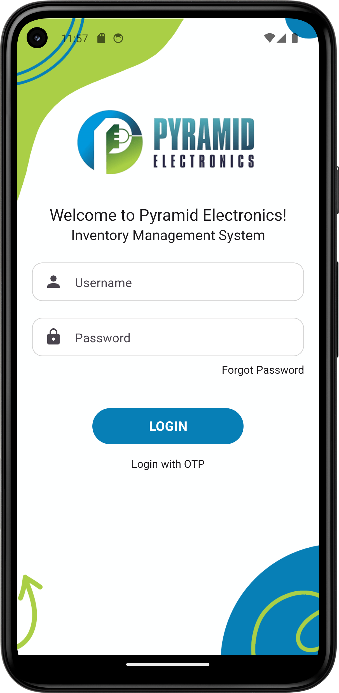
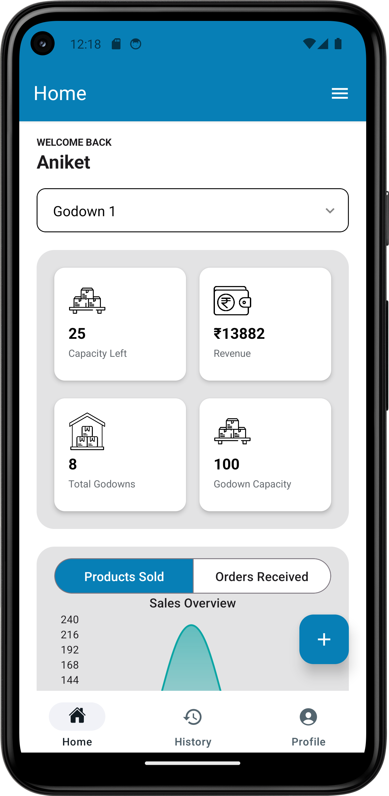
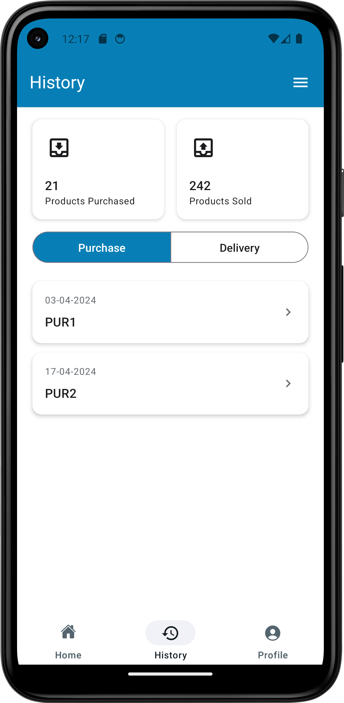
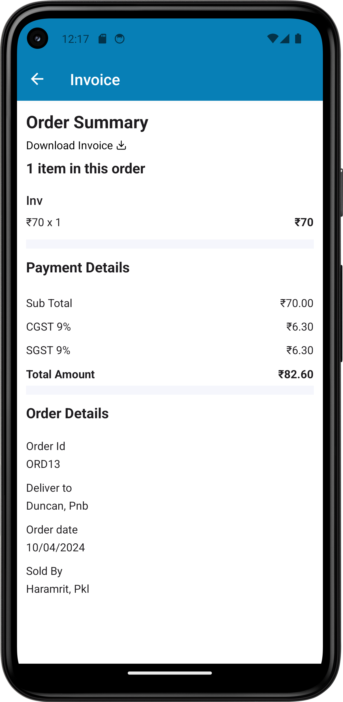
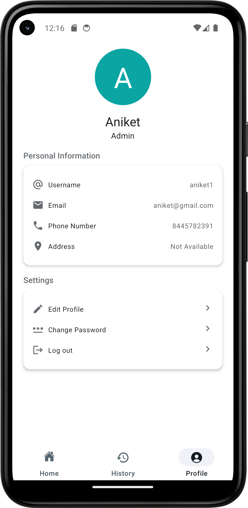
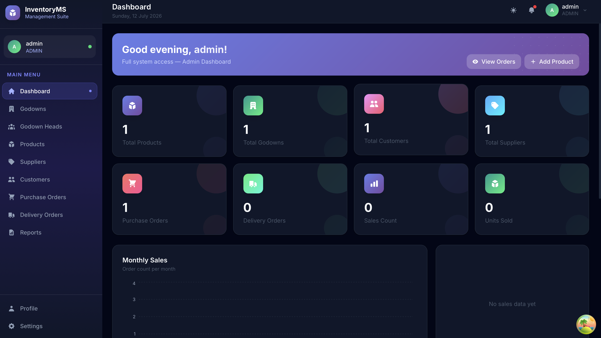
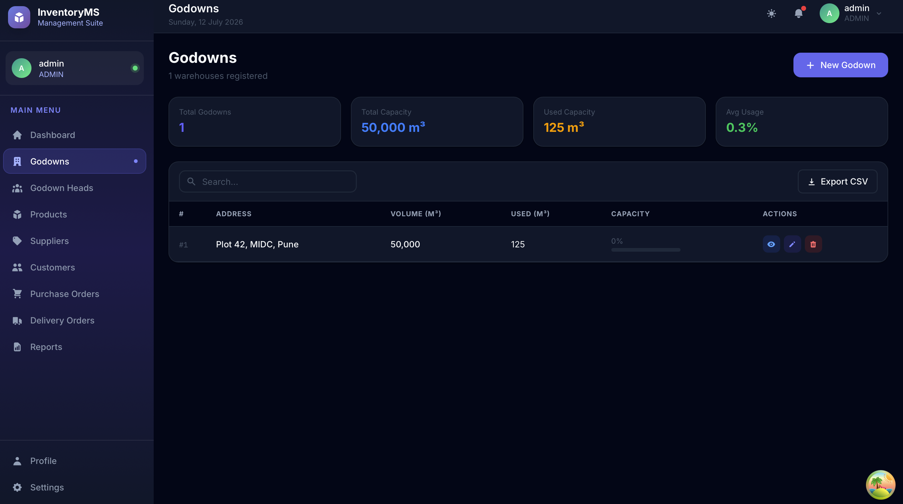
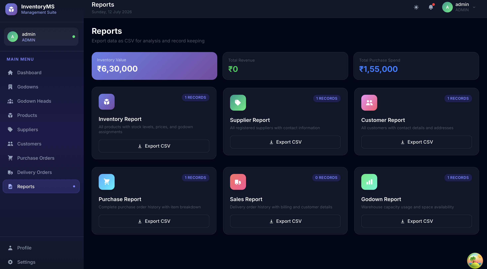

<div align="center">

# Inventory Management System

### A full-stack, production-ready Inventory Management System with a **React Native mobile app**, **React.js admin panel**, and a **Spring Boot REST API backend**.

<br/>

[](https://spring.io/projects/spring-boot)
[](https://reactnative.dev/)
[](https://react.dev/)
[](https://www.mysql.com/)
[](https://jwt.io/)
[](https://tailwindcss.com/)
[](LICENSE)

<br/>

[📱 Mobile App](#-mobile-app-features) · [🖥️ Admin Panel](#️-admin-panel-features) · [⚙️ Backend](#️-backend--api-features) · [🚀 Quick Start](#-installation--setup) · [📸 Screenshots](#-screenshots)

</div>

---

## 📋 Table of Contents

- [Overview](#-overview)
- [Features](#-features)
  - [Mobile App](#-mobile-app-features)
  - [Admin Panel](#️-admin-panel-features)
  - [Backend / API](#️-backend--api-features)
- [Technology Stack](#-technology-stack)
- [System Architecture](#-system-architecture)
- [Project Folder Structure](#-project-folder-structure)
- [Backend Architecture](#-backend-architecture)
  - [Entity Models](#entity-models)
  - [DTOs](#dtos)
  - [Repositories](#repositories)
  - [Services](#services)
  - [Controllers](#controllers)
  - [Security & Authentication](#security--authentication)
- [API Overview](#-api-overview)
- [Database Schema](#-database-schema)
- [Installation & Setup](#-installation--setup)
  - [Prerequisites](#prerequisites)
  - [Backend Setup](#1-backend-spring-boot)
  - [Admin Panel Setup](#2-admin-panel-reactjs)
  - [Mobile App Setup](#3-mobile-app-react-native)
- [Environment Variables](#-environment-variables)
- [Running the Project](#-running-the-project)
- [Screenshots](#-screenshots)
- [Future Improvements](#-future-improvements)
- [Contributors](#-contributors)
- [License](#-license)

---

## 🌟 Overview

**Inventory Management System** is an enterprise-grade, multi-platform solution for managing warehouse inventory, purchase and delivery orders, godowns (warehouses), and godown heads (managers).

The system supports **two distinct roles**:

| Role | Access |
|------|--------|
| 🔴 **ADMIN** | Full access — manages all godowns, heads, products, suppliers, customers, orders, analytics, and reports |
| 🔵 **GODOWN HEAD** | Scoped access — manages their assigned godown's inventory, purchase and delivery orders |

The system is built as three independent, interconnected applications:

1. **Spring Boot REST API** — the single source of truth for all business logic and data
2. **React Native Mobile App** — for Godown Heads managing inventory on-the-go
3. **React.js Admin Panel** — for Admins managing the full system from a browser

---

## ✨ Features

### 📱 Mobile App Features

- 🔐 **Authentication** — Username/password login and OTP-based login via registered phone number
- 🔑 **Forgot Password** — OTP-based password reset flow
- 🏠 **Home Dashboard** — Welcome banner, godown selector, capacity left, revenue, total godowns, godown capacity, and animated Sales Overview chart
- 📦 **Inventory Management** — View and manage products in assigned godown
- 🛒 **Purchase Orders** — View purchase history (PUR1, PUR2...) with product breakdown
- 🚚 **Delivery Orders** — Create and manage delivery orders with cart and bill generation
- 🧾 **Invoice Screen** — Full order summary including items, GST breakdown (CGST/SGST at 9% each), and order details
- 📜 **History Screen** — Toggle between Purchase and Delivery history with count summary
- 👤 **Profile Screen** — View personal info (username, email, phone, address), edit profile, change password, and logout
- 🎨 **Modern UI** — Clean, mobile-first design with teal/blue brand palette

---

### 🖥️ Admin Panel Features

- 🔐 **Role-Based Authentication** — JWT-secured login with auto-redirect based on role
- 🌙 **Dark / Light Mode** — System-wide theme toggle, persisted in localStorage
- 📊 **Analytics Dashboard** — Animated stat cards (products, godowns, customers, suppliers, orders), area chart (monthly sales), bar chart (monthly order quantity), pie chart (top products), recent deliveries feed, inventory value summary
- 🏭 **Godown Management** — Full CRUD, capacity progress bars, product list per godown, assign head
- 👷 **Godown Head Management** — Register, view, assign to godown
- 📦 **Product Management** — Full CRUD, category filter, low-stock warnings, stock status badges, CSV export
- 🏷️ **Supplier Management** — Full CRUD with search and CSV export
- 👥 **Customer Management** — Full CRUD with search and CSV export
- 🛒 **Purchase Orders** — Create multi-item orders with supplier/godown selection and live total preview
- 🚚 **Delivery Orders** — Place orders with customer selection, product picker, quantity/price entry, and GST bill preview
- 📈 **Reports** — Export Inventory, Supplier, Customer, Purchase, Sales, and Godown reports as CSV
- 👤 **Profile** — View/edit profile, change password
- ⚙️ **Settings** — Theme toggle, notification preferences, account info
- 🔒 **Route Guards** — `ProtectedRoute` and `RoleRoute` components block unauthorized access
- 🦴 **Skeleton Loaders** — Cards, tables, and charts all show skeleton states during API calls
- 🎞️ **Animations** — Framer Motion on every page transition, card, modal, sidebar, stat counter, and chart

---

### ⚙️ Backend / API Features

- 🔐 **JWT Authentication** — Stateless, HS256-signed tokens; role embedded as claim
- 📱 **OTP Login & Reset** — Phone-number-based OTP generation with 5-minute expiry, email delivery
- 👥 **Role-Based Authorization** — `ADMIN` and `GODOWNHEAD` roles enforced at the Security Filter level
- 🏭 **Godown Module** — CRUD, capacity tracking (`volume` / `usedVolume`)
- 👷 **Godown Head Module** — Register, profile update, password change
- 📦 **Product Module** — CRUD by name+godown, top-selling query, product names array for dropdowns
- 🏷️ **Supplier Module** — CRUD
- 👥 **Customer Module** — CRUD with field mapping (`customerNo` / `customerAddress`)
- 🛒 **Purchase Order Module** — Multi-item purchase creation, stock auto-increment, purchase history
- 🚚 **Delivery Order Module** — Multi-item delivery placement, stock auto-decrement, GST calculation, full invoice data
- 📊 **Analytics Module** — Sales count, daily sales, monthly sales, monthly order quantity, weekly sales, top products
- 🗂️ **DTO-First Design** — No entity exposed directly; all responses use typed `Responses.*` DTOs
- 🔄 **CORS** — Configured for all origins (development-friendly)
- 💌 **Mail Integration** — Spring Mail for OTP delivery with graceful fallback

---

## 🛠 Technology Stack

| Layer | Technology |
|---|---|
| **Mobile App** | React Native, Expo, React Navigation, Axios, React Hook Form, AsyncStorage |
| **Admin Panel** | React 19, Vite, Tailwind CSS v4, React Router DOM v7, TanStack Query, Framer Motion, Recharts, React Hook Form, React Hot Toast, Headless UI |
| **Backend Language** | Java 17 |
| **Backend Framework** | Spring Boot 3.2 |
| **Security** | Spring Security, JJWT 0.11.5 (HS256) |
| **ORM** | Spring Data JPA, Hibernate |
| **Database** | MySQL 8.0 |
| **Mail** | Spring Mail (Gmail SMTP) |
| **Build Tool** | Maven |
| **API Style** | RESTful JSON |

---

## 🏗 System Architecture

```
┌─────────────────────────────────────────────────────────┐
│                    Client Layer                          │
│                                                          │
│   ┌──────────────────┐    ┌──────────────────────────┐  │
│   │  React Native    │    │  React.js Admin Panel     │  │
│   │  Mobile App      │    │  (Vite + Tailwind CSS)    │  │
│   │  (Expo)          │    │                           │  │
│   └────────┬─────────┘    └─────────────┬─────────────┘  │
└────────────┼──────────────────────────── ┼───────────────┘
             │  HTTP/REST + JWT Bearer      │
             ▼                             ▼
┌─────────────────────────────────────────────────────────┐
│                Spring Boot API Layer                     │
│                                                          │
│  ┌──────────┐  ┌──────────┐  ┌──────────┐  ┌─────────┐ │
│  │  Auth    │  │ Godown   │  │ Product  │  │  Order  │ │
│  │Controller│  │Controller│  │Controller│  │Controller│ │
│  └────┬─────┘  └────┬─────┘  └────┬─────┘  └────┬────┘ │
│       │              │              │              │      │
│  ┌────▼─────────────────────────────────────────▼────┐  │
│  │              Service Layer (Business Logic)        │  │
│  └────────────────────────┬───────────────────────────┘  │
│                           │                              │
│  ┌────────────────────────▼───────────────────────────┐  │
│  │         Repository Layer (Spring Data JPA)         │  │
│  └────────────────────────┬───────────────────────────┘  │
└───────────────────────────┼──────────────────────────────┘
                            │  JDBC
                            ▼
┌─────────────────────────────────────────────────────────┐
│                     MySQL 8.0                           │
│  godown │ godown_head │ product │ supplier │ customer   │
│  purchase_order │ purchase_order_item                   │
│  delivery_order │ delivery_order_item                   │
└─────────────────────────────────────────────────────────┘
```

**Request Flow:**
```
Client Request
    → JwtFilter (extract & validate Bearer token)
    → SecurityContext (set Authentication)
    → Controller (@RestController)
    → Service (business logic, DTO mapping)
    → Repository (JPQL / derived queries)
    → MySQL
    ← Service (map entity → DTO)
    ← Controller (ResponseEntity<DTO>)
    ← Client Response (plain JSON, no wrapper)
```

---

## 📁 Project Folder Structure

```
pyramid-electronics-ims/
│
├── 📂 inventory-backend/                   # Spring Boot Backend
│   └── src/main/java/com/inventory/
│       ├── InventoryApplication.java
│       ├── entity/                         # JPA Entities
│       ├── repository/                     # Spring Data Repositories
│       ├── dto/
│       │   ├── Requests.java               # All inbound DTOs
│       │   └── Responses.java              # All outbound DTOs
│       ├── service/                        # Business Logic
│       ├── controller/                     # REST Controllers
│       ├── security/
│       │   ├── JwtUtil.java
│       │   └── JwtFilter.java
│       └── config/
│           └── SecurityConfig.java
│   └── src/main/resources/
│       ├── application.properties
│       └── schema.sql
│
├── 📂 ims-frontend/                        # React.js Admin Panel
│   └── src/
│       ├── api/                            # Axios API modules
│       │   ├── axios.js
│       │   ├── authApi.js
│       │   ├── godownApi.js
│       │   ├── godownHeadApi.js
│       │   ├── productApi.js
│       │   ├── supplierApi.js
│       │   ├── customerApi.js
│       │   ├── purchaseApi.js
│       │   ├── deliveryApi.js
│       │   └── dashboardApi.js
│       ├── animations/                     # Framer Motion variants
│       ├── components/
│       │   ├── ui/                         # Button, Input, Card, Modal, Badge...
│       │   ├── layout/                     # AppLayout, Sidebar, Topbar
│       │   ├── charts/                     # Recharts components
│       │   └── tables/                     # DataTable with sort/filter/export
│       ├── context/                        # AuthContext, ThemeContext
│       ├── pages/                          # All page components
│       ├── routes/                         # AppRouter, guards
│       ├── constants/                      # Query keys, routes, colors
│       └── utils/                          # formatCurrency, exportToCSV...
│
└── 📂 mobile-app/                          # React Native Mobile App
    └── src/
        ├── api/
        ├── screens/
        │   ├── LoginScreen/
        │   ├── HomeScreen/
        │   ├── HistoryScreen/
        │   ├── ProfileScreen/
        │   ├── GodownScreen/
        │   ├── ProductListScreen/
        │   ├── SupplierScreen/
        │   ├── CustomerScreen/
        │   └── AddDeliveryOrderScreen/
        ├── components/
        ├── context/
        └── navigation/
```

---

## 🔧 Backend Architecture

### Entity Models

| Entity | Table | Key Fields |
|---|---|---|
| `Godown` | `godown` | `godownId`, `address`, `volume`, `usedVolume` |
| `GodownHead` | `godown_head` | `godownHeadId`, `username`, `password`, `godownheadNo`, `role`, `otp`, `otpExpiry` |
| `Product` | `product` | `productId`, `productName`, `productCategory`, `totalQuantity`, `productVolume`, `price` |
| `Supplier` | `supplier` | `supplierId`, `supplierName`, `contactNumber`, `email`, `address` |
| `Customer` | `customer` | `customerId`, `customerName`, `contactNumber`, `address` |
| `PurchaseOrder` | `purchase_order` | `purchaseId`, `orderDate`, `totalAmount`, `status`, FK→`supplier`, FK→`godown` |
| `PurchaseOrderItem` | `purchase_order_item` | `itemId`, `productName`, `quantity`, `unitPrice`, `totalPrice`, FK→`purchaseOrder` |
| `DeliveryOrder` | `delivery_order` | `deliveryId`, `orderDate`, `subTotal`, `cgstPercent`, `sgstPercent`, `totalAmount`, FK→`customer`, `godown`, `godownHead` |
| `DeliveryOrderItem` | `delivery_order_item` | `itemId`, `productName`, `quantity`, `sellPrice`, `totalPrice`, FK→`deliveryOrder` |

---

### DTOs

All request and response data is strictly typed — no entities are exposed directly.

**`Requests.java`** (inner static classes):

| Class | Used By |
|---|---|
| `LoginRequest` | `POST /api/login` |
| `OtpRequest` | `POST /api/sendOtp` |
| `VerifyOtpRequest` | `POST /api/verifyotp` |
| `ResetPasswordRequest` | `PATCH /api/resetpassword` |
| `LoginWithOtpRequest` | `POST /api/loginWithOtp` |
| `RegisterRequest` | `POST /api/register` |
| `GodownRequest` | `POST /api/createGodown` |
| `ProductRequest` | `POST /api/addProduct` |
| `UpdateProductByNameRequest` | `PATCH /api/updateProduct` |
| `SupplierRequest` | `POST /api/createSupplier`, `PUT /api/updateSuppliers` |
| `CustomerRequest` | `POST /api/createCustomer`, `PUT /api/updateCustomerById/{id}` |
| `PurchaseOrderRequest` | `POST /api/createPurchaseOrder` |
| `DeliveryOrderRequest` | `POST /api/placeOrder/{customerId}` |

**`Responses.java`** (inner static classes):

| Class | Frontend Reads |
|---|---|
| `LoginResponse` | `cookie`, `username`, `godownHeadId`, `godownId`, `role` |
| `ProductResponse` | `productId`, `productName`, `godownId` (flat) |
| `CustomerResponse` | `customerId`, `customerNo`, `customerAddress` (mapped) |
| `GodownResponse` | `godownId`, `address`, `volume`, `productList[]` |
| `CapacityResponse` | `availableCapacity`, `total`, `used` |
| `DeliveryOrderResponse` | `orderId`, `products[]`, `totalSellPrice`, `godownHeadName`, `godownAddress` |
| `PurchaseOrderResponse` | `purchaseId`, `purchaseDate`, `products[]`, `purchaseQuantity` |
| `SalesCountResponse` | `saleOrdersCount`, `totalQuantitiesSold` |
| `MonthlySalesResponse` | `Month` (uppercase), `salesCount` |
| `MonthlyOrderQtyResponse` | `Month` (uppercase), `orderQuantity` |

---

### Repositories

| Repository | Notable Custom Queries |
|---|---|
| `GodownHeadRepository` | `findByUsername`, `findByGodownheadNo`, `findByGodown_GodownId`, `existsByUsername` |
| `ProductRepository` | `findByProductNameAndGodown_GodownId`, `findTopSellingProducts`, `findTopSellingProductsByGodown` |
| `DeliveryOrderRepository` | `sumQuantitiesByGodownId`, `countByGodownIdAndDate`, `findMonthlySalesByGodownAndYear`, `findMonthlyOrderQtyByGodownAndYear`, `findWeeklySales` |
| `PurchaseOrderRepository` | `countPurchasedProductsByGodownId`, `countAllPurchasedProducts` |

---

### Services

| Service | Responsibilities |
|---|---|
| `AuthService` | Login, OTP generation/verification, OTP login, password reset, BCrypt encoding |
| `GodownHeadService` | Register, profile update, password change, lookup by godown |
| `GodownService` | CRUD, capacity calculation, product list enrichment |
| `ProductService` | CRUD, top-selling query, product name array, stock/volume management |
| `SupplierService` | CRUD |
| `CustomerService` | CRUD with field mapping (`customerNo` ↔ `contactNumber`) |
| `OrderService` | Purchase creation (stock increment), delivery placement (stock decrement, GST calc), all analytics |

---

### Controllers

| Controller | Base Path | Key Endpoints |
|---|---|---|
| `AuthController` | `/api` | `POST /login`, `/register`, `/sendOtp`, `/verifyotp`, `/loginWithOtp`, `PATCH /resetpassword` |
| `GodownController` | `/api` | `GET/POST /createGodown`, `GET /getAllGodown`, `GET /getGodown/{id}`, `GET /getCapacity/{id}` |
| `GodownHeadController` | `/api` | `GET /getGodownHead`, `GET /getGodownHead/{id}`, `GET /getGodownHeadByGodownId/{id}`, `PUT /updateGodownHead` |
| `ProductController` | `/api` | `GET /listAllProducts`, `GET /listProducts/{godownId}`, `POST /addProduct`, `PATCH /updateProduct`, `GET /getAllProduct` |
| `SupplierController` | `/api` | `GET /getAllSuppliers`, `POST /createSupplier`, `PUT /updateSuppliers` |
| `CustomerController` | `/api` | `GET /getAllCustomers`, `POST /createCustomer`, `PUT /updateCustomerById/{id}` |
| `OrderController` | `/api` | `GET /getAllPurchaseOrders`, `POST /createPurchaseOrder`, `GET /getDeliveryOrders`, `POST /placeOrder/{customerId}`, all analytics endpoints |

---

### Security & Authentication

```
Request
  └─► JwtFilter (OncePerRequestFilter)
        ├─ Extracts "Authorization: Bearer <token>"
        ├─ JwtUtil.isValid(token) → JJWT HS256 verify
        ├─ JwtUtil.extractUsername(token) → set SecurityContext
        └─ JwtUtil.extractRole(token) → set GrantedAuthority "ROLE_<ROLE>"

SecurityConfig
  ├─ Stateless session (no JSESSIONID)
  ├─ Public: /api/login, /api/loginWithOtp, /api/sendOtp, /api/verifyotp, /api/resetpassword
  ├─ All others: authenticated
  └─ CORS: all origins, all methods (dev-friendly)
```

**JWT Payload:**
```json
{
  "sub": "ramesh",
  "role": "GODOWNHEAD",
  "iat": 1720000000,
  "exp": 1720086400
}
```

---

## 📡 API Overview

### Authentication

| Method | Endpoint | Description | Auth |
|--------|----------|-------------|------|
| `POST` | `/api/login` | Username + password login | ❌ Public |
| `POST` | `/api/loginWithOtp` | Phone + OTP login | ❌ Public |
| `POST` | `/api/sendOtp` | Send OTP to phone | ❌ Public |
| `POST` | `/api/verifyotp` | Verify OTP | ❌ Public |
| `PATCH` | `/api/resetpassword` | Reset password via phone | ❌ Public |
| `POST` | `/api/register` | Register new Godown Head | 🔒 JWT |
| `POST` | `/api/logout` | Acknowledge logout | 🔒 JWT |

### Godown

| Method | Endpoint | Description |
|--------|----------|-------------|
| `GET` | `/api/getAllGodown` | List all godowns |
| `GET` | `/api/getGodown/{id}` | Godown detail + product list |
| `GET` | `/api/getCapacity/{godownId}` | Available capacity |
| `GET` | `/api/getGodwnCount` | Total godown count |
| `POST` | `/api/createGodown` | Create godown → returns plain string |
| `PUT` | `/api/createGodown/{id}` | Update godown |
| `DELETE` | `/api/createGodown/{id}` | Delete godown |

### Products

| Method | Endpoint | Description |
|--------|----------|-------------|
| `GET` | `/api/listAllProducts` | All products (flat `godownId`) |
| `GET` | `/api/listProducts/{godownId}` | Products in one godown |
| `GET` | `/api/getAllProduct` | Name arrays for dropdown |
| `GET` | `/api/getTopSellingProducts/{godownId}` | Top sellers per godown |
| `POST` | `/api/addProduct` | Create product |
| `PATCH` | `/api/updateProduct` | Update by name+godownId |
| `DELETE` | `/api/updateProduct/{id}` | Delete product |

### Orders

| Method | Endpoint | Description |
|--------|----------|-------------|
| `POST` | `/api/createPurchaseOrder` | Create purchase order |
| `GET` | `/api/getAllPurchaseOrders` | All purchase orders |
| `GET` | `/api/getPurchaseOrderByPurchaseId/{id}` | Purchase detail |
| `POST` | `/api/placeOrder/{customerId}` | Place delivery order |
| `GET` | `/api/getDeliveryOrders` | All delivery orders |
| `GET` | `/api/getDeliveryOrdersById/{id}` | Delivery detail + bill |

### Analytics

| Method | Endpoint | Description |
|--------|----------|-------------|
| `GET` | `/api/getTotalSalesCount/{godownId}` | `saleOrdersCount`, `totalQuantitiesSold` |
| `GET` | `/api/getSalesByDate?godownId=X&date=Y` | Daily sales metrics |
| `GET` | `/api/getSalesByMonth/{godownId}` | 12-month sales array |
| `GET` | `/api/getOrderQuantityByMonth/{godownId}` | 12-month order quantity |
| `GET` | `/api/getSalesByWeek` | Weekly sales |

> **Response Contract:** All endpoints return plain DTOs — **no `ApiResponse` wrapper**. The frontend reads `response.data` directly as the payload.

---

## 🗄 Database Schema

```sql
godown              godown_head
──────────          ───────────────────
godown_id (PK)      godown_head_id (PK)
address             godown_head_name
volume              username (UNIQUE)
used_volume         password
                    email
                    godownhead_no
                    otp / otp_expiry
                    role
                    godown_id (FK→godown)

product             supplier            customer
───────────         ─────────────       ──────────────
product_id (PK)     supplier_id (PK)    customer_id (PK)
product_name        supplier_name       customer_name
product_category    contact_number      contact_number
total_quantity      email               email
product_volume      address             address
price
product_type
unit
godown_id (FK)

purchase_order              purchase_order_item
──────────────────          ───────────────────
purchase_id (PK)            item_id (PK)
supplier_id (FK)            purchase_id (FK)
godown_id (FK)              product_name
order_date                  quantity
total_amount                unit_price
status                      total_price

delivery_order              delivery_order_item
──────────────────          ────────────────────
delivery_id (PK)            item_id (PK)
customer_id (FK)            delivery_id (FK)
godown_id (FK)              product_name
godown_head_id (FK)         quantity
order_date                  sell_price
sub_total                   total_price
cgst_percent / amount
sgst_percent / amount
total_amount
status
```

---

## 🚀 Installation & Setup

### Prerequisites

| Tool | Version | Download |
|------|---------|----------|
| Java JDK | 17+ | [adoptium.net](https://adoptium.net/) |
| Maven | 3.8+ | [maven.apache.org](https://maven.apache.org/) |
| MySQL | 8.0+ | [mysql.com](https://www.mysql.com/) |
| Node.js | 18+ | [nodejs.org](https://nodejs.org/) |
| npm | 9+ | Included with Node.js |
| Expo CLI | Latest | `npm install -g expo-cli` |

---

### 1. Backend (Spring Boot)

```bash
# Clone repository
git clone https://github.com/your-username/pyramid-electronics-ims.git
cd pyramid-electronics-ims/inventory-backend

# Create MySQL database
mysql -u root -p
CREATE DATABASE inventory_db CHARACTER SET utf8mb4 COLLATE utf8mb4_unicode_ci;
EXIT;

# (Optional) Run schema to pre-create tables + seed admin
mysql -u root -p inventory_db < src/main/resources/schema.sql

# Configure credentials
nano src/main/resources/application.properties

# Build and run
mvn clean install
mvn spring-boot:run
```

The API will start at **`http://localhost:8080`**

> Default admin credentials: `username: admin` / `password: Admin@1234`

---

### 2. Admin Panel (React.js)

```bash
cd pyramid-electronics-ims/ims-frontend

# Install dependencies
npm install

# Copy environment file and configure
cp .env.example .env
# Edit VITE_API_BASE_URL if backend is not on localhost:8080

# Start development server
npm run dev
```

The admin panel will start at **`http://localhost:3000`**

```bash
# Production build
npm run build
```

---

### 3. Mobile App (React Native)

```bash
cd pyramid-electronics-ims/mobile-app

# Install dependencies
npm install

# Configure backend URL (edit the api/axiosConfig.js or urls.js)
# Set serverUrl to your machine's local IP (not localhost)

# Start Expo
npx expo start

# Run on Android
npx expo run:android

# Run on iOS
npx expo run:ios
```

> **Note:** For the mobile app to reach your backend, replace `localhost` with your machine's LAN IP address (e.g. `192.168.1.10:8080`).

---

## 🔑 Environment Variables

### Backend — `application.properties`

```properties
# Server
server.port=8080

# Database
spring.datasource.url=jdbc:mysql://localhost:3306/inventory_db?useSSL=false&serverTimezone=UTC
spring.datasource.username=root
spring.datasource.password=your_password

# JPA
spring.jpa.hibernate.ddl-auto=update
spring.jpa.show-sql=false

# JWT (must be ≥ 32 characters)
jwt.secret=InventoryManagementSystemSecretKeyForJWT2024
jwt.expiration=86400000

# SMTP (Gmail)
spring.mail.host=smtp.gmail.com
spring.mail.port=587
spring.mail.username=your-email@gmail.com
spring.mail.password=your-app-password
spring.mail.properties.mail.smtp.starttls.enable=true
```

### Admin Panel — `.env`

```env
VITE_API_BASE_URL=http://localhost:8080
```

### Mobile App — `api/urls.js` or `axiosConfig.js`

```js
const BASE_URL = 'http://192.168.1.10:8080';  // Your LAN IP
```

---

## ▶️ Running the Project

Start all three services in order:

```bash
# Terminal 1 — Backend
cd inventory-backend
mvn spring-boot:run

# Terminal 2 — Admin Panel
cd ims-frontend
npm run dev

# Terminal 3 — Mobile App
cd mobile-app
npx expo start
```

| Service | URL |
|---------|-----|
| 🔵 Backend API | http://localhost:8080 |
| 🟢 Admin Panel | http://localhost:3000 |
| 📱 Expo DevTools | http://localhost:8081 |
| 🔧 React Query Devtools | Click icon in browser (dev only) |

---

## 📸 Screenshots

### 📱 Mobile App

<table>
  <tr>
    <td align="center">
      <br/>
      <sub><b>Login Screen</b></sub>
    </td>
    <td align="center">
      <br/>
      <sub><b>Home Dashboard</b></sub>
    </td>
    <td align="center">
      <br/>
      <sub><b>History Screen</b></sub>
    </td>
  </tr>
  <tr>
    <td align="center">
      <br/>
      <sub><b>Invoice / Bill Screen</b></sub>
    </td>
    <td align="center">
      <br/>
      <sub><b>Profile Screen</b></sub>
    </td>
    <!-- <td align="center">
      <!-- Placeholder for future screenshot -->
      <br/>
      <sub><b>More Screenshots</b></sub>
    </td> -->
  </tr>
</table>

---

### 🖥️ Admin Panel

<table>
  <tr>
    <td align="center">
      <br/>
      <sub><b>Admin Dashboard — Stats & Charts</b></sub>
    </td>
    <td align="center">
      <br/>
      <sub><b>Godowns — Capacity & CRUD</b></sub>
    </td>
  </tr>
  <tr>
    <td align="center">
      <br/>
      <sub><b>Reports — CSV Export</b></sub>
    </td>
    <!-- <td align="center">
      <!-- Placeholder for products/orders screenshot -->
      <br/>
      <sub><b>Products / Orders Management</b></sub>
    </td> -->
  </tr>
</table>

> 📌 **Note for contributors:** Place actual screenshots in the `screenshots/mobile/` and `screenshots/admin/` directories and update the image paths above. The current paths follow the convention `screenshots/{platform}/{page}.png`.

---

## 🔮 Future Improvements

- [ ] 📊 **Advanced Analytics** — Date range picker, revenue vs cost comparison, profit margin charts
- [ ] 🔔 **Push Notifications** — Real-time low-stock and order alerts via Firebase Cloud Messaging
- [ ] 📄 **PDF Invoice Generation** — Download styled PDF invoices directly from the app and admin panel
- [ ] 🔍 **Barcode/QR Scanning** — Mobile barcode scanner for product lookup and order creation
- [ ] 📦 **Bulk Import** — Excel/CSV upload for bulk product and customer import
- [ ] 🖼️ **Product Images** — Image upload and storage (AWS S3 or Cloudinary)
- [ ] 🌍 **Multi-language Support** — i18n for English, Hindi, and regional languages
- [ ] 🔄 **Token Refresh** — Silent JWT refresh to extend sessions without re-login
- [ ] 📱 **Tablet Layout** — Optimized split-view layout for iPad / Android tablets
- [ ] 🏷️ **GST Configurability** — Admin-configurable CGST/SGST rates per product category
- [ ] 🧪 **Unit & Integration Tests** — JUnit 5 + Mockito for backend, Vitest + React Testing Library for frontend
- [ ] 🐳 **Docker Compose** — Single-command local stack with containers for Spring Boot + MySQL
- [ ] ☁️ **Cloud Deployment** — CI/CD pipeline with GitHub Actions → AWS ECS / Railway / Render

---

## 👥 Contributors


> Want to contribute? Feel free to open a Pull Request or raise an Issue. See [CONTRIBUTING.md](CONTRIBUTING.md) for guidelines.

---

## 📄 License

```
MIT License

Copyright (c) 2026

Permission is hereby granted, free of charge, to any person obtaining a copy
of this software and associated documentation files (the "Software"), to deal
in the Software without restriction, including without limitation the rights
to use, copy, modify, merge, publish, distribute, sublicense, and/or sell
copies of the Software, and to permit persons to whom the Software is
furnished to do so, subject to the following conditions:

The above copyright notice and this permission notice shall be included in all
copies or substantial portions of the Software.

THE SOFTWARE IS PROVIDED "AS IS", WITHOUT WARRANTY OF ANY KIND.
```

See the full [LICENSE](LICENSE) file for details.

---

<div align="center">

**Made with ❤️ for IMS**

⭐ If this project helped you, please give it a star on GitHub!

[](https://github.com/your-username/pyramid-electronics-ims)

</div>
